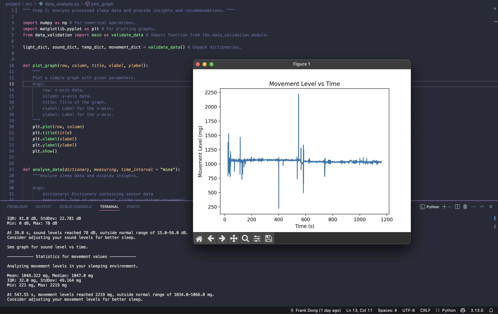
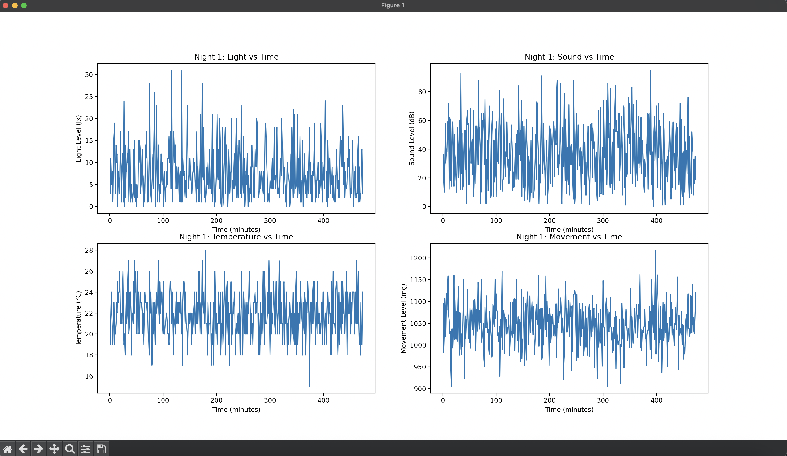
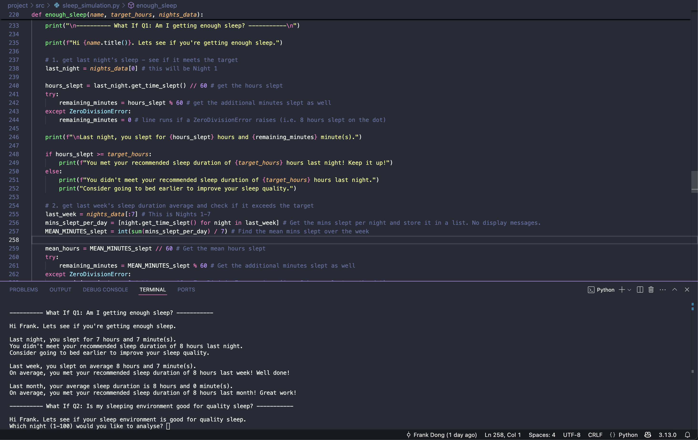
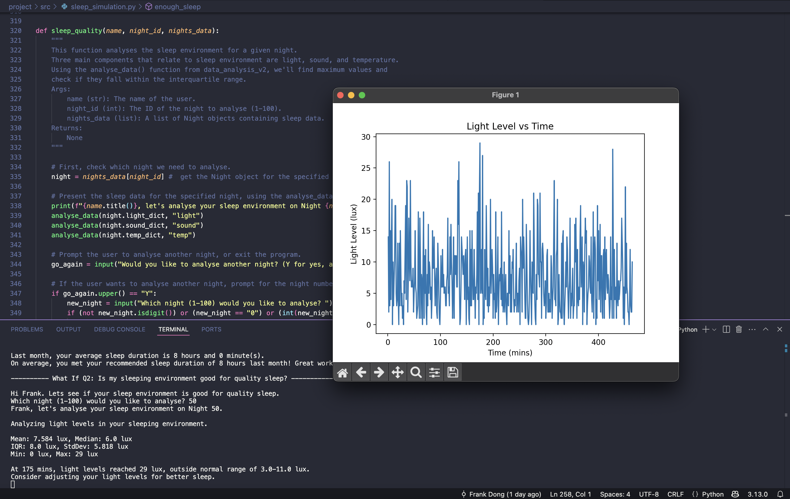

# 💤 Sleep Analytics Simulation & Recommendation Engine

This project simulates and analyses 100 nights of sleep using real sensor data gathered from a wearable Micro:bit device. It was originally built as part of my **Leaving Certificate Computer Science final project** in March 2024. Since then, I’ve revisited and refined it through the lens of my growing interest in **data analytics** and **data science**.

---

## 🎯 Project Motivation

The original brief was to solve a real-world wellbeing problem using digital technology. I chose to track and analyse sleep quality — something deeply personal and relatable — using real-world hardware and Python analytics.

This project became the **first spark** of my interest in data analytics. Looking back now, I see it as an early, hands-on exploration of the full **data lifecycle**: collection, validation, analysis, modelling, insight generation, and storytelling.

---

## 🧰 Tools Used

- 🧠 **BBC Micro:bit**: Wrist-worn device for movement, light, temperature, and sound monitoring  
- 📊 **Excel**: Used briefly for reviewing and exploring survey and sensor outputs  
- 🐍 **Python**: Core language used across all scripts  
- 📈 **Matplotlib**: Visualising time series trends from simulated sleep data  
- 📦 **NumPy**: Used for generating normally distributed values and summary statistics

> 🧪 **Planned upgrade**: In a future version, I hope to incorporate `pandas` for more structured, efficient data wrangling and storage.

---

## 📐 Project Structure

This is an **end-to-end data analysis and simulation project**, designed to mimic a real-world analytics workflow:

1. **📡 Data Collection**  
   Real-time sleep sensor data was gathered using a Micro:bit receiver and stored in a `.csv` file.

2. **🧼 Data Cleaning & Validation**  
   Using rule-based Python scripts, raw data was parsed, filtered, and prepared for analysis (e.g. empty string handling, invalid values, and conversion to floats/integers).

3. **📊 Exploratory Data Analysis (EDA)**  
   Key metrics like **mean**, **standard deviation**, and **time series graphs** were generated for light, sound, temperature, and movement.

4. **🧪 Statistical Modelling & Simulation**  
   The cleaned one-night dataset was used as the basis to simulate **100 synthetic nights** of sleep using normal distribution sampling and **object-oriented programming**.

5. **💡 Insight Generation ("What If" Scenarios)**  
   The system answers two natural-language wellness queries:
   - *"Am I getting enough sleep?"*
   - *"Is my sleep environment good enough?"*

6. **📈 Data Storytelling & Visualisation**  
   Each synthetic night can be visualised with four time-series graphs, showing trends in light, temperature, sound, and movement minute-by-minute.

7. **📝 Reflection**  
   A critical **June 2025 preface** reflects on the project’s assumptions, limitations, and lessons learned. The full report is linked below.

---

## 🌟 Key Features

- ✅ Real-time data collection using Micro:bit
- ✅ CSV data cleaning & validation (empty value handling, rule-based filtering)
- ✅ Exploratory statistics & visualisations for each metric
- ✅ `Night` class with object-oriented modelling of simulated sleep logs
- ✅ 100-night dataset generation with realistic variation
- ✅ Graphs generated via `matplotlib` subplots
- ✅ “What If” logic to personalise sleep health recommendations
- ✅ Fully interactive CLI experience

---

### Micro:bit Sensor Visualisation 

Here's a time-series plot of movement levels during sleep, tracked with the micro:bit and generated using matplotlib.



---

### Sleep Environment Graphs Example

Here’s an example of four subplots, generated with matplotlib, describing the sleep environment for a simulated night:



---

### Sleep Duration Feedback Example

Here’s how the program outputs sleep duration feedback, based on a user-inputted target sleep duration:



---

### Personalised Environment Feedback Example

Here's how the program provides recommendations based on the simulated sleep environment:



---

## 📄 Final Report & Reflection

A full report (originally submitted for the state assessment) is available as a PDF:

📎 [**Download Report (with 2025 Preface)**](report-2025.pdf)

It includes:
- A **critical preface** written in June 2025 reflecting on assumptions, flaws, and takeaways.
- Background context
- Methodology
- Survey results
- Screenshots and code snippets

---

## ▶️ Project Demo Video

🎥 **[Watch the original demo (March 2024)](https://youtu.be/a6n9EpFGZ3A?si=klyn8XrMHBxtJ7lV)**  
This unlisted video demonstrates the Micro:bit setup and walks through the Python code used in the original submission.

> ⚠️ **Note:** Since March 2024, the Python files have been fully refactored:
> - Cleaner logic with `main()` functions
> - Added docstrings and improved commenting
> - Switched to f-strings and modular code layout
> - Follows PEP 8 formatting standards

---

## 🧪 How to Run Locally

### 1. Clone the repo
```bash
git clone https://github.com/FD2906/sleep-tracker
```

### 2. Install requirements

```bash
pip install -r requirements.txt
```

### 3. Run scripts

- Data Validation 

```bash
python project/src/data_validation.py
```

- EDA & Stats

```bash
python src/data_analysis.py
```

- Simulation & Insight Generation

```bash
python src/sleep_simulation.py
```

## 🧠 Final Thoughts

This project is a foundation - not a final product. 
It reflects how far I've come, but also how much there is to learn. 
I'm proud of what this project sparked: a genuine interest in the power of data to improve wellbeing and solve real human problems. 
